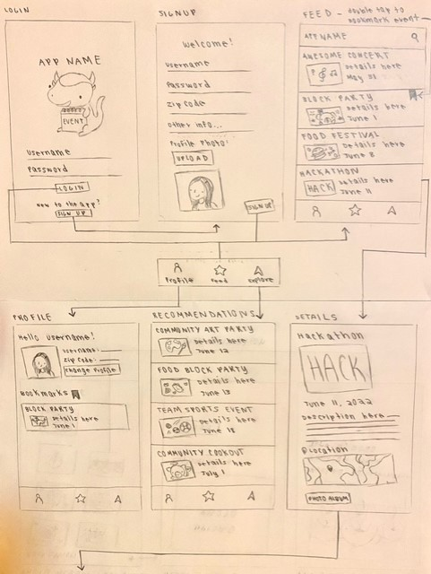
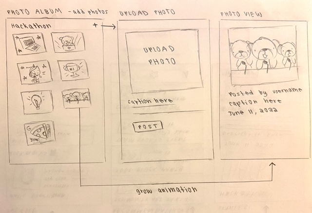

# Event Finder

## Table of Contents
1. [Overview](#Overview)
1. [Product Spec](#Product-Spec)
1. [Wireframes](#Wireframes)
2. [Schema](#Schema)

## Overview
### Description
Event Finder is an Android app that encourages users to build community and connect with others by empowering them to find local events and share related photos. This app is a combination of event finding in EventBrite and photo sharing in Google Drive in a mobile-friendly format.

### App Evaluation
- **Category:** Social Networking / Photo / Entertainment
- **Mobile:** Mobile-first experience
- **Story:** Enables users to find events near them, get personalized event recommendations, bookmark events, and share photos from events
- **Market:** This app is for everyone, especially those looking for entertainment and to connect with others through events. The photo sharing feature of ths app is especially great for large community events like festivals, hackathons, recreational classes, and more!
- **Habit:** This app could be used as much as the user wants depending on their interest in attending events.
- **Scope:** Start with core features like viewing events, finding events, and being able to upload photos from the event. Then, expand on features such as recommending events, exploring events on a map, integrating calendars and SMS, among others. 

## Product Spec

### 1. User Stories (Required and Optional)

**Required Must-have Stories**

* User can log in or register for an account to access their profile
    * User can view their profile with their username and bookmarked events
    * User can add types of events they're interested in to their profile, which gets factored in to algorithm of recommended events
* User can scroll through events near them
    * **User can view events, which are cached locally using Room database**
    * User can double tap on events to bookmark them
    * User can click on an event to see details screen
* **User can get personalized event recommendations based on their indicated interested events and bookmarks**
    * User can see a feed of recommended events and click on event to see details screen
* User can upload and view photos from the event
    * User can add a caption when uploading photos
    * User can select a photo to view and see a growing animation
* User sees animations when navigating between screens 
* User can see custom splash screen when opening app
* User can see error page and change zip if no events found nearby

**Bolding** denotes difficult/ambiguous technical problems

**Optional Nice-to-have Stories**

* Revamped MVVM app architecture
* Handled edge cases
* User can view events near them on a map
    * User can zoom out and see events near each other combine into one pin
    * User can tap on events on the map to get pop up details and navigate to detail screen
    * User can pinch to zoom on map
* User can look up events by name
* User can refresh feed
* User can swipe left if they are not interested in the event
* User can swipe right if they are interested in the event (which bookmarks them)
* User can scroll infinitely
* User can edit their username and password
* User can see time stamp for photo
* User can get notified when an event they bookmarked is happening soon
* User can invite friends to events by clicking a button to launch SMS with prefilled info
* User can add an event to their calendar
* User can create a collage of photos in an album
* User can use the map to get directions to an event
* User can get recommended events based on their past bookmarked events
   * User can add types of events they're interested in to their profile and get recommended events in those categories
* User can get info about the organizer of the event
   * User can click a button to contact the organizer of the event
* User can filter events by selected time frame
* User can set a price range for events they want to see
* User can toggle between light mode and dark mode

### 2. Screen Archetypes

* Login Screen
   * User can log in or click to register for an account
* Sign Up Screen
   * User can register for an account
* Stream (Profile, Feed, and Explore fragments)
   * User can view a feed of events
   * User can explore events by category
   * User can double tap events to bookmark them
* Detail
   * User can view event details
   * User can view photos from an event
* Creation 
   * User can upload a photo for an event

### 3. Navigation

**Tab Navigation** (Tab to Screen)

* Events Stream
* Profile
* Recommendations

**Flow Navigation** (Screen to Screen)
* Events Stream
   * Event Details 
      * Photo Album
      * Add Photo
* Profile with Bookmarked Events
   * Event Details  
* Recommendations
   * Event Details

## Wireframes




## Schema 

### Models

User

| Property     | Type      | Description     |
| ------------ | --------- | ----------------|
| objectId | String | unique id for the user (default field) |
| username	| String | user's account username |
| password	| String | user's account password |
| bio	| String | user's bio |
| zip	| Number | user zip code |
| event_categories_string	| String | user's selected event categories of interest |
| event_categories | Array | user's selected event categories of interest |
| createdAt | DateTime | date when account is created (default field) |
| updatedAt | DateTime | date when account is last updated (default field) |
| ACL | ACL | permissions (default field) |

Photo

| Property     | Type      | Description     |
| ------------ | --------- | ----------------|
| objectId | String | unique id for the photo (default field) |
| user	| Pointer to User | user |
| event| String | event id from API that photo is from |
| image | File | image that user posts |
| caption | String | photo caption by user |
| createdAt | DateTime | date when photo is created (default field) |
| updatedAt | DateTime | date when photo is last updated (default field) |

Bookmark

| Property     | Type      | Description     |
| ------------ | --------- | ----------------|
| objectId | String | unique id for the photo (default field) |
| user | Pointer to User | user |
| eventId | String | event id from API that photo is from |
| category | String | category event belongs to |
| createdAt | DateTime | date when photo is created (default field) |
| updatedAt | DateTime | date when photo is last updated (default field) |

### Networking
* Event Feed Screen
   * (Read/GET) Query all events
   * (Create/POST) Bookmark an event
   * (Delete) Delete existing bookmark
* Add Photo Screen
   * (Create/POST) Create a new photo object and caption
* Profile Screen
   * (Read/GET) Query logged in user object
   * (Read/GET) Query bookmarked posts
   * (Delete) Delete existing bookmark
* Recommendation Screen
   * (Read/GET) Query logged in user object
   * (Read/GET) Query bookmarked posts
   * (Delete) Delete existing bookmark
* Error Screen
   * (Update/PUT) Update user's zip
   
### Third-Party Libraries
* [Lottie](https://lottiefiles.com/): Supports implementation of high-quality animations in a space-efficient way
* [Retrofit](https://square.github.io/retrofit/): Serves as type-safe REST client for Android for authenticating/interacting with APIs and sending network requests with OkHttp
* [Room](https://developer.android.com/jetpack/androidx/releases/room): Serves as an abstraction layer over SQLite that enables local database access using queries
* [Glide](https://github.com/bumptech/glide): Supports fetching, loading, and displaying images in a fast and efficent way 

### Parse Query Code Snippet Example
```java
    private void queryPhotos(String eventId) {
        ParseQuery<Photo> query = ParseQuery.getQuery(Photo.class);
        query.whereEqualTo(Photo.KEY_EVENT_ID, eventId);
        query.include(Photo.KEY_USER);
        query.include(Photo.KEY_EVENT_ID);
        query.setLimit(POST_LIMIT);
        query.addDescendingOrder("createdAt");
        query.findInBackground((photos, e) -> {
            if (e != null) {
                Toast.makeText(PhotoAlbumActivity.this, "Failed to query posts", Toast.LENGTH_LONG).show();
                return;
            }
            allPhotos.addAll(photos);
            photoAdapter.notifyDataSetChanged();
        });
    }
```
